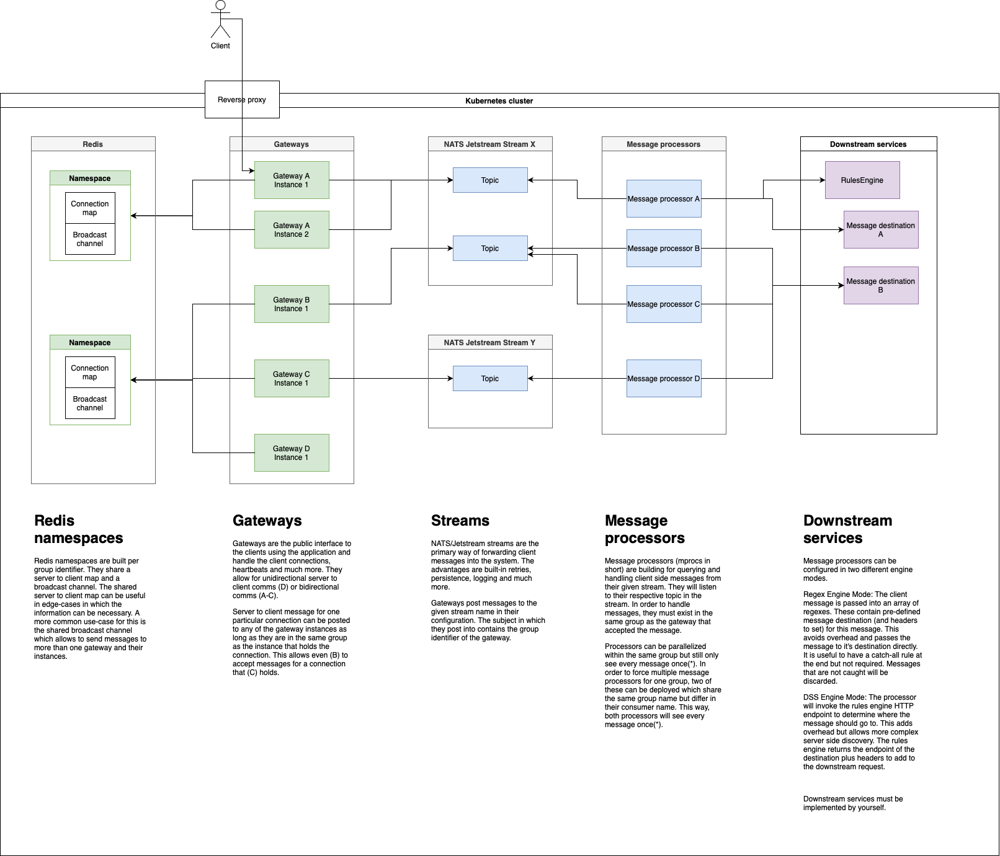

# hydrogen

`hydrogen` is a kubernetes native API gateway for websocket connections that indirects messages into HTTP requests.

## Release schemes & cycles

As `hydrogen` now gets more complete in it's feature set, there are final preparations to be made before releasing a v1.

There will be `1.0.0-alpha.x` releases first with the first coming up end of June 2022. These are meant to be for testing purposes only and will primarily serve for identifying which things are still missing that have not come up yet. \
Following the alpha releases, there will be a beta phase. The feature set for v1.0 will be complete upon entering the beta phase and there will only be fixes made to the existing features. At this point in time, the documentation about the software will also be much more in depth and detailed although it might not be 100% complete. \
Following the beta phase with release candidates, v1.0 will be published. Following the v1.0 release, `hydrogen` will strictly adhere to the `semver v2` versioning scheme.

## Roadmap to v1

All work, features and generally everything that will be included in / done before the v1.0 release will be bundled in [this milestone](https://github.com/voidpointergroup/hydrogen/milestone/1).

## v1.0 features

* **Gateway & Message processor deployment via CRDs & custom resources** \
  Gateways and message processors are not deployed from the HELM chart but can be deployed by creating the respective custom resources which will then be synced by the operator that is running in the namespace. This allows ingress/egress route definition similar to other gateways, n-k relations between gateways and message processors (eg. many gateways (routes) -> single processor). \
  Changes to the spec of the CRs will result in the components related to this resource being recreated.
* **Bidirectional communication (client <--> server)** \
  Client messages are sent from the client, server messages are sent towards any running instance of hydrogen and forwarded towards the client from the instance that holds it's connection. \
  Avoiding persistent connections towards your service is crucial to reach a near zero downtime when deploying and an increased consumer satisfaction.
* **Broadcasting** \
  Broadcast messages to all connections that are connected to instances of one group. This can be interesting for periodic updates, ticks or similar use-cases with connections that act as subscriptions to updates.
* **Flexible routing** \
  You can choose from letting the mproc application run in `regex` or in `dss` mode. Regex mode will evaluate the messages based on a regular expression and, if it matches, forward the message to the corresponding service. DSS mode will invoke a separate rules engine service that determines and returns the destination for the message which the server then invokes.
* **Built-in authorizer** \
  It brings built in authorization that is performed before a persistent connection is established.
* **OnConnect/OnDisconnect services** \
  These are invoked when a client has connected / disconnected respectively.
* **Monitoring** \
  Structured log messages for events and, if configured, interval reporting about the application's state are available.
* **Easy installs via HELM charts** \
  It's easy to install the application - just do a helm install with the appropriate chart values and you're ready to go.
* **Multi language / framework support** \
  By deciding against a DSL or other language/framework lock-ins for routing etc., you can implement authorization, connect, message routing, message handling and disconnect in your own favorite language. The only implementations required are the routing service and at least one destination for messages it points to. In regex mode, the mproc will use regular expressions to determine the message destination.
* **Message persistence and retries** \
  Messages are sent to a NATS/Jetstream stream which will buffer messages and only release if they are acknowledged. This abstraction into an async architecture will guarantee an at-least-once delivery for client->server messages.
* **Connection contexts** \
  The authorizer can return a context object for the connection if it authorizes it. This context will be included in every client to server message and be available for the downstream services to use.
* **Forced disconnects** \
  Sending a disconnect request via the respective route to any gateway will lead to the specified connection being forced to disconnect with the given reason. Useful if you want to enforce a new authorization.

## v1 Architecture abstract

